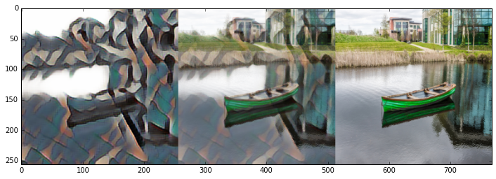
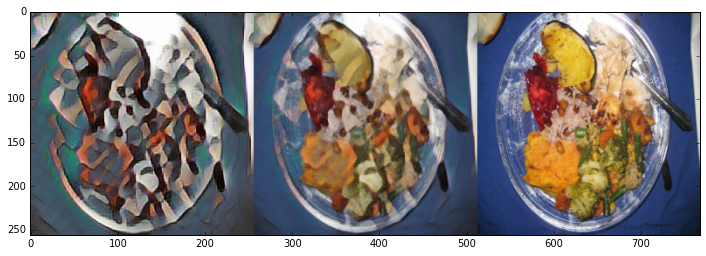
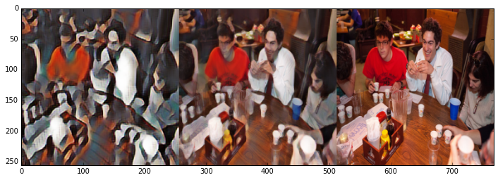

## keras_tf_neural_img

* code : https://github.com/misgod/fast-neural-style-keras

* paper : https://arxiv.org/pdf/1603.08155.pdf

* download data from http://images.cocodataset.org/zips/val2017.zip and save to data/content

## style images

## result

see the transform notebooks or train notebooks

